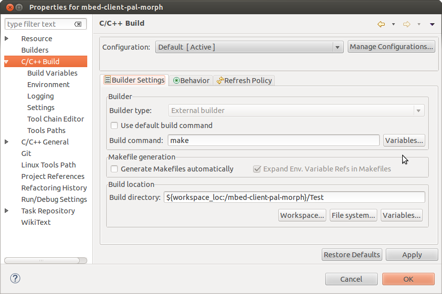
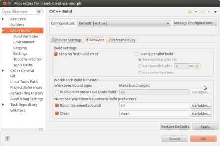

# PAL Test Guide
## Environment Setup
Python 2.7.11
If you cannot find Python 2.7.11 for your linux you can get it here [Python 2.7.11](https://launchpad.net/~fkrull/+archive/ubuntu/deadsnakes-python2.7)
Install the needed Python modules on Windows like this:
```
python -m pip install tabulate
python -m pip install pyserial
python -m pip install -U mbed-ls
python -m pip install shell
python -m pip install pypiwin32
```
On Linux you install the same modules like this:
```
sudo pip install <module>
```

##Test Code files
Each API has three files under Test/Unitest or Test/Conformance:

* **pal_socket_test.c** 	Contains the test code in the form of functions. One function per test.
* **pal_ socket _test_runner.c** 	Runs the test functions defined above.
* **pal_ socket _test_main_mbedos.c** 	Main application that runs all the tests. May also have test specific initializations for the given target platform.

Each API can also have a common utilities file under Test/Common
**pal_socket_test_utils.c/.h**	 Utility functions that can be used in various pal_socket test apps.
**pal_socket_test.c**
Contains tests of the form:

```
#include "pal_socket.h"
#include "unity.h"
#include "unity_fixture.h"

TEST(pal_socket, FunctionWhichReturnsLocalVariable_ShouldReturnTheCurrentCounterValue)
{
    //This should be true because setUp set this up for us before this test
    TEST_ASSERT_EQUAL_HEX(0x5a5a, FunctionWhichReturnsLocalVariable());

    //This should be true because we can still change our answer
    Counter = 0x1234;
    TEST_ASSERT_EQUAL_HEX(0x1234, FunctionWhichReturnsLocalVariable());
}
```
**pal_ socket _test_runner.c**
Looks like  this:
```
#include "unity.h"
#include "unity_fixture.h" // pal Socket API tests

TEST_GROUP_RUNNER(pal_socket)
{
#if (PAL_INCLUDE || FindFunction_WhichIsBroken_ShouldReturnZeroIfItemIsNotInList_WhichWorksEvenInOurBrokenCode)
  RUN_TEST_CASE(pal_socket, FindFunction_WhichIsBroken_ShouldReturnZeroIfItemIsNotInList_WhichWorksEvenInOurBrokenCode);
#endif
#if (PAL_INCLUDE || FindFunction_WhichIsBroken_ShouldReturnTheIndexForItemsInList_WhichWillFailBecauseOurFunctionUnderTestIsBroken)
  RUN_TEST_CASE(pal_socket, FindFunction_WhichIsBroken_ShouldReturnTheIndexForItemsInList_WhichWillFailBecauseOurFunctionUnderTestIsBroken);
#endif
#if (PAL_INCLUDE || FunctionWhichReturnsLocalVariable_ShouldReturnTheCurrentCounterValue)
  RUN_TEST_CASE(pal_socket, FunctionWhichReturnsLocalVariable_ShouldReturnTheCurrentCounterValue);
#endif
#if (PAL_INCLUDE || FunctionWhichReturnsLocalVariable_ShouldReturnTheCurrentCounterValueAgain)
  RUN_TEST_CASE(pal_socket, FunctionWhichReturnsLocalVariable_ShouldReturnTheCurrentCounterValueAgain);
#endif
#if (PAL_INCLUDE || FunctionWhichReturnsLocalVariable_ShouldReturnCurrentCounter_ButFailsBecauseThisTestIsActuallyFlawed)
  RUN_TEST_CASE(pal_socket, FunctionWhichReturnsLocalVariable_ShouldReturnCurrentCounter_ButFailsBecauseThisTestIsActuallyFlawed);
#endif}
```


**pal_ socket _test_main_mbedos.c**
This can vary a lot from platform to platform and test to test, but will contain lines like the following to run the tests:
```
extern "C" int UnityMain(int argc, const char* argv[], void (*runAllTests)(void));
extern "C" void TEST_pal_socket_GROUP_RUNNER(void);

	// Run a group of tests
    	UnityMain(0, argv, TEST_pal_socket_GROUP_RUNNER);
```

 
## Test makefile framework
**makefile** – Master make file. It has an entry for each platform target. Includes all_tests.mk.
Configuration specific defines are declared as follows and converted to compilation defines on the compilation command line.
**TARGET_CONFIGURATION_DEFINES:= HAS_RTOS    HAS_FS**
They can be also be used to as conditionals in the make file as shown in all_tests.mk
```
include make_platform.mk 


.PHONY: all clean check

#====================================================
# Platform mbed-os
TARGET_PLATFORM:=mbedosClassic
TARGET_CONFIGURATION_DEFINES:=  HAS_RTOS
all: mbedosClassic_all
check: mbedosClassic_check
clean: mbedosClassic_clean 
include all_tests.mk
#====================================================
# Platform morpheus
TARGET_PLATFORM:=mbedOS
TARGET_CONFIGURATION_DEFINES:=  HAS_RTOS
all: mbedOS_all
check: mbedOS_check
clean: mbedOS_clean 
include all_tests.mk
#====================================================
```
**make_platform.mk** – Detects the make platform (Windows, Linux) and sets various definitions accordingly. These are referred to by other make files in order to keep them platform independent.
**all_tests.mk** – contains an entry for each test application to be built. Included by all target platform make files. It looks like this:
```
#====================================================
PROJECT=pal_socket
TYPE=Unity

$(PROJECT)_ADDITIONAL_ SOURCES:=

include BUILD_TEST.mk
#====================================================
ifeq ($(findstring HAS_RTOS,$(TARGET_CONFIGURATION_DEFINES)),HAS_RTOS)
PROJECT=pal_rtos
TYPE=Unitest

$(PROJECT)_ADDITIONAL_SOURCES:=Source/PAL-Impl/Modules/RTOS/$(PROJECT).c \
				Source/PAL-Impl/Modules/RTOS/$(PROJECT)_static_definitions_sample.c \
				Source/Port/Reference-Impl/mbedOS/pal_plat_rtos.c


include BUILD_TEST_$(TARGET_PLATFORM).mk
endif
#====================================================
```
**BUILD_TEST_BUILD_TEST_mbedOS.mk, BUILD_TEST_FreeRTOS.mk** – Target platform specific make definitions and rules. Defines targets for building the tests. Included for each test that is to be built.
##Usage:
###Make all tests for all platforms:
**make** 
or make all tests for a specific platform:
**make mbedOS_all**
**make FreeRTOS_all**

### To make and run one set of tests:
**make mbedOS_pal_socket**

### To make and run only one test from a set:
**make mbedOS_pal_socket** PAL_TEST=”FindFunction_WhichIsBroken_ShouldReturnZeroIfItemIsNotInList_WhichWorksEvenInOurBrokenCode”
To make a binary that just runs two tests from a set:
**make  mbedOS_pal_socket PAL_TEST=”FindFunction_WhichIsBroken_ShouldReturnZeroIfItemIsNotInList_WhichWorksEvenInOurBrokenCode  FindFunction_WhichIsBroken_ShouldReturnTheIndexForItemsInList_WhichWillFailBecauseOurFunctionUnderTestIsBroken”**
Note: If you change the argument PAL_TEST, then you will need to force a rebuild with  –B.

### To run all tests:
**make mbedOS_check**
### Run a specific test:
**make mbedOS_check_pal_socket**
 
## Eclipse
It is possible to use the Build command from eclipse. 
First set it up to run make as follows. Note that the build directory points to Test:


 
You can control which target you build in the next tab by changing all and clean.




